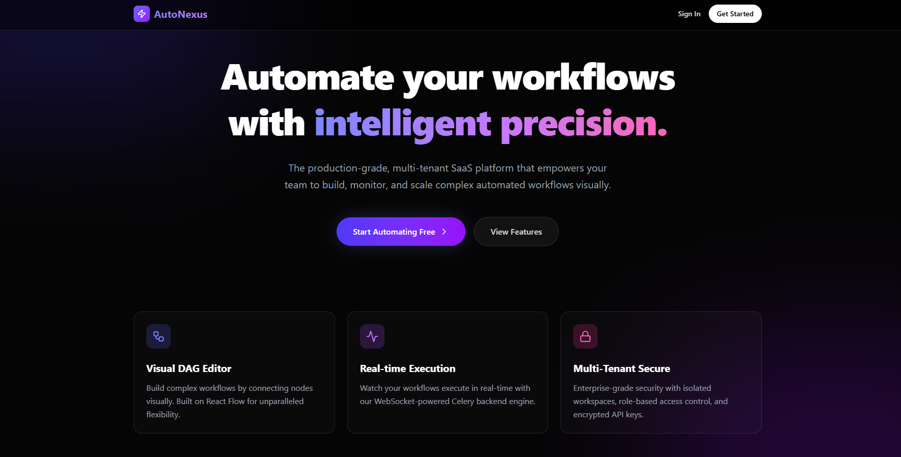

# AutoNexus - Multi-Tenant SaaS Workflow Automation Platform

A production-grade, horizontally scalable workflow automation platform with multi-tenancy, billing, a visual DAG editor, and real-time execution monitoring.

## Product Preview



Live Project: [https://autonexus-automation.vercel.app/](https://autonexus-automation.vercel.app/)

## Architecture

```text
+-------------+      +-------------+      +-------------+
|   Next.js   | ---> |    Nginx    | ---> |   FastAPI   |
|  Frontend   |      |   Gateway   |      |     API     |
+-------------+      +-------------+      +------+------+
                                                  |
                       +-------------+      +------+------+
                       |   Celery    | <--> |    Redis    |
                       |   Workers   |      | BrokerCache |
                       +------+------+
                              |
                       +------+------+
                       | PostgreSQL  |
                       |  Database   |
                       +-------------+
```

## Quick Start

```bash
# 1. Clone and configure
cp .env.example .env
# Edit .env with your secrets

# 2. Start all services
docker-compose up -d

# 3. Run database migrations
docker-compose exec api alembic upgrade head

# 4. Access the platform
# API:      http://localhost:8000/api/docs
# Frontend: http://localhost:3000
# Flower:   http://localhost:5555 (docker-compose --profile monitoring up)
```

## Tech Stack

| Layer | Technology |
|-------|------------|
| Backend API | FastAPI (async) |
| Task Engine | Celery + Redis |
| Database | PostgreSQL + SQLAlchemy |
| Frontend | Next.js + TypeScript + Tailwind CSS |
| DAG Editor | React Flow (@xyflow/react) |
| Auth | JWT (access + refresh tokens) |
| Infra | Docker, Kubernetes, Nginx |
| CI/CD | GitHub Actions |
| Observability | structlog + Prometheus |

## Features

- **Multi-Tenant**: Row-level isolation via `tenant_id`, workspace-based user management.
- **RBAC**: Admin, Developer, and Viewer roles with granular permissions.
- **Visual Workflow Builder**: Drag-and-drop DAG editor with React Flow.
- **Workflow Actions**: Duplicate, archive, and delete workflows directly from the dashboard list.
- **Distributed Execution**: Celery-based task execution with horizontal scaling.
- **Real-Time Updates**: WebSocket streaming for live execution status.
- **Billing**: Usage tracking, plan-based rate limiting, and mock Stripe integration.
- **API Keys**: Programmatic access with scoped, hashed API keys.
- **Kubernetes Ready**: Health probes, ConfigMaps, persistent storage, and production ingress support.
- **Observability**: Structured JSON logging and Prometheus metrics.

## Project Structure

```text
backend/                 # FastAPI + Celery
  app/
    api/v1/              # Route handlers
    core/                # Config, security, deps
    models/              # SQLAlchemy ORM
    schemas/             # Pydantic validation
    services/            # Business logic
    middleware/          # Tenant, rate-limit, logging
    workers/             # Celery tasks
    websockets/          # Real-time handlers
  alembic/               # DB migrations
frontend/                # Next.js app
infra/                   # Infra support files
.github/workflows/       # CI/CD pipeline
docs/                    # README assets
```

## API Endpoints

| Method | Endpoint | Description |
|--------|----------|-------------|
| POST | `/api/v1/auth/register` | Create workspace and admin user |
| POST | `/api/v1/auth/login` | Get JWT tokens |
| POST | `/api/v1/auth/refresh` | Refresh access token |
| GET | `/api/v1/users/me` | Current user profile |
| GET/POST | `/api/v1/workflows` | List or create workflows |
| PATCH | `/api/v1/workflows/{id}` | Update workflow DAG |
| DELETE | `/api/v1/workflows/{id}` | Delete a workflow |
| POST | `/api/v1/workflows/{id}/execute` | Trigger execution |
| GET | `/api/v1/workflows/{id}/executions` | Execution history |
| POST | `/api/v1/webhooks/{id}/trigger` | Webhook trigger |
| GET | `/api/v1/billing/usage` | Usage summary |
| POST | `/api/v1/billing/subscribe` | Change plan |
| WS | `/ws/executions/{id}` | Live execution stream |

## License

This project is licensed under the [MIT License](LICENSE).
